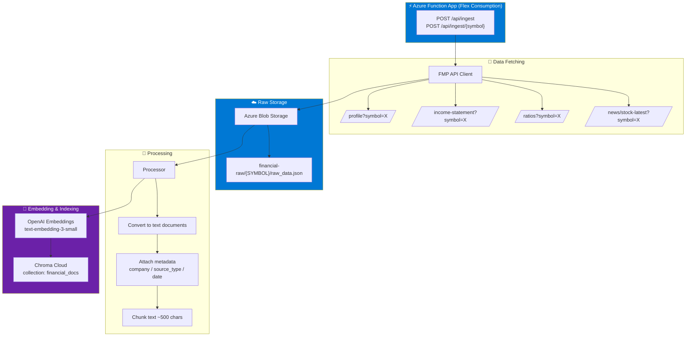

# Financial Data Ingestion Pipeline

Azure Function App that ingests financial data from the Financial Modeling Prep API, stores raw data in Azure Blob Storage, and indexes processed documents in Chroma Cloud.

## Architecture



## Setup

1. Copy `local.settings.json.example` to `local.settings.json` and fill in your keys
2. Install dependencies:
   ```bash
   pip install -r requirements.txt
   ```

## Run Locally

```bash
func start
```

## Trigger Ingestion

```bash
# Ingest all companies (AAPL, MSFT, NVDA)
curl -X POST http://localhost:7071/api/ingest

# Ingest a specific company
curl -X POST http://localhost:7071/api/ingest/AAPL
```

## Deploy to Azure (Flex Consumption)

```bash
az functionapp create \
  --resource-group <rg-name> \
  --name <app-name> \
  --storage-account <storage-name> \
  --runtime python \
  --runtime-version 3.11 \
  --functions-version 4 \
  --flexconsumption-location eastus \
  --subscription 7aec3ed0-7ec5-498e-9284-6f21c94def7d

func azure functionapp publish <app-name>
```
